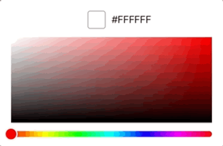

# Colory

A `UIControl` for picking color from HSB color palette.


P.S. Gradient looks way smoother on device than this gif.

## Usage

Colory has very simple API.

Register action with `valueChanged` event to receive picked color changes.

```
let pickerView = ColorPickerView()
pickerView.addTarget(self, action: #selector(colorChanged(_:)), for: .valueChanged)
```


Use `color` property to get and set currently picked color.

```
@objc func colorChanged(_ pickerView: ColorPickerView) {
    update(with: pickerView.color)
}
```

Use `layoutMargins` to customize palette margins.
```
pickerView.layoutMargins = UIEdgeInsets(top: pickerView.layoutMargins.top,
                                        left: 20,
                                        bottom: pickerView.layoutMargins.bottom,
                                        right: 20)
```

## LICENSE

This library is released under [MIT License](LICENSE).
